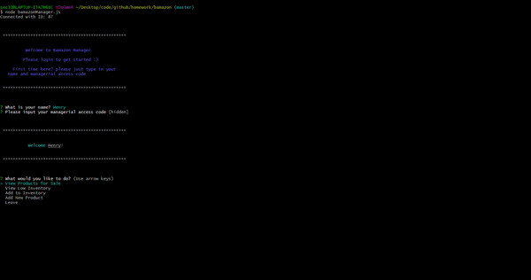

# Bamazon Command Line Shopping App

## Customer View

 - successfully logging in with a saved username and password

 - succesfully logging in as a new user

 - What if you type in a wrong password?

 - I want to buy more than there is...

 - OK, I'll buy an amount that is actually there

 - How much did I spend at this store? 

## Manager View

 - I'm not hacking, I have the correct code!

 - I think I'll just try my own code! 

 - View the products for sale and which ones are low inventory

 - I want to update the inventory!
 
 - I want to add a new product for sale!

### Made with Node.js and MySQL 